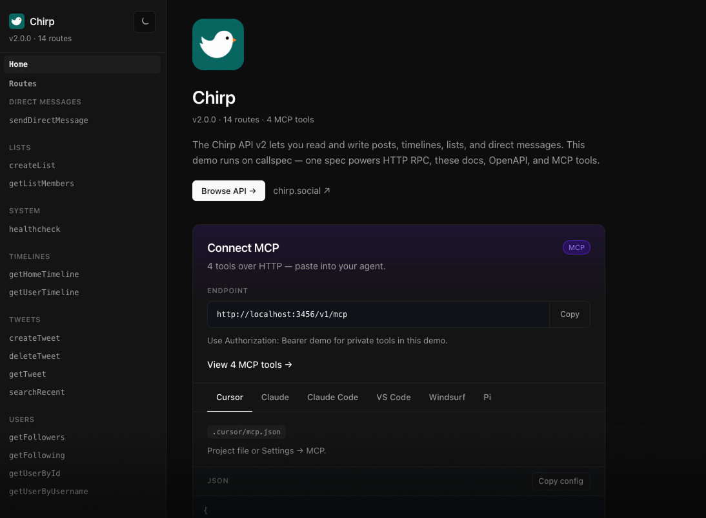

<div align="center">
  <picture>
    <source srcset="assets/callspec-lockup-light.svg" media="(prefers-color-scheme: light)" />
    <source srcset="assets/callspec-lockup-dark.svg" media="(prefers-color-scheme: dark)" />
    
  </picture>

  <p><strong>One registry — ship RPC, docs, OpenAPI, MCP, and a typed client.</strong></p>

  <p>
    
    
    <a href="https://github.com/mhweiner/autorel"></a>
    <a href="https://opensource.org/licenses/MIT"></a>
    
  </p>

  <p>
    Define your API once with runtyp. callspec mounts HTTP RPC, white-label docs, OpenAPI&nbsp;3.1, MCP tools, and a typed client from the same handlers — no duplicate schemas, no bolt-on doc stack.
  </p>

  <p>
    <a href="assets/callspec-ui-chirp-demo-home.png">
      
    </a>
  </p>
</div>

> **Early.** APIs and defaults may change before v1.0. Feedback and contributors welcome.

## Highlights

- **One registry** — add a route once; HTTP, docs, OpenAPI, MCP, and client stay in sync
- **callspec UI** — built-in, white-label docs with try-it-out and a **Connect MCP** panel (Cursor, Claude, VS Code, Windsurf, Pi, …)
- **Built-in MCP** — `mcp: true` on a route; same handlers and schemas as HTTP, no separate process
- **OpenAPI 3.1** — JSON Schema from runtyp preds at `GET /openapi.json`
- **Typed client** — fetch-only `callspec/client` subpath, safe in browser bundles
- **One mount** — `mountRegistry` wires RPC, docs, spec, and MCP; toggle each surface independently

| Surface | How you get it |
|---------|----------------|
| **HTTP RPC** | `POST /v1/<methodName>` |
| **Interactive docs** | **callspec UI** at `/docs` |
| **OpenAPI 3.1** | `GET /openapi.json` |
| **MCP tools** | `mcp: true` → `tools/list` + `tools/call` at `/mcp` |
| **Typed client** | `client<API['searchRecent']>('searchRecent', input)` |

## Example

```typescript
import {defineRegistry, defineRoute, mountRegistry} from 'callspec';
import {predicates as p} from 'runtyp';

export const api = defineRegistry({
    searchRecent: defineRoute({
        input: p.object({
            query: p.string({description: 'Search query (supports from:, #hashtag, …)'}),
            max_results: p.optional(p.number({range: {min: 1, max: 100}})),
        }),
        meta: {
            summary: 'Search recent posts',
            tags: ['posts'],
        },
        access: 'private',
        mcp: true,
        handler: searchRecent,
    }),
});

mountRegistry(app, api, {
    contextResolver: getAuthContext,
    docs: {
        openApi: {title: 'My API', version: '1.0.0'},
        ui: {
            branding: {name: 'My API', logoUrl: './brand/mark.png'},
        },
    },
});
```

## Getting started

```bash
npm i callspec runtyp express
```

**Requirements:** Node.js 18+, TypeScript 5+, Express 4.x (peer).

**Try the demo** (in this repo):

```bash
npm run build && npm run dev:docs
```

Open [http://127.0.0.1:3456/v1/docs](http://127.0.0.1:3456/v1/docs) — Chirp sample API. Use `Authorization: Bearer demo` for private routes and MCP tools.

## Go deeper

| Topic | Section |
|-------|---------|
| MCP server & Connect panel | [MCP server](#mcp-server) |
| White-label docs UI | [callspec UI](#callspec-ui) |
| Public vs private routes | [Auth](#auth) |
| runtyp → JSON Schema → OpenAPI | [OpenAPI & runtyp](#openapi--runtyp) |
| Browser-safe fetch client | [Client](#client) |
| Local dev & CI | [Development](#development) |
| Source layout | [Package layout](#package-layout) |

# MCP server

No separate MCP process. No hand-maintained tool manifest. No stdio bridge.

1. **Opt in per route** — `mcp: true` on any `defineRoute`. Input/output schemas come from the same runtyp preds as HTTP.
2. **Built into `mountRegistry`** — when any route opts in, MCP mounts at `/mcp` automatically (override with `mcp: { path, serverInfo, instructions }` or disable with `mcp: false`).
3. **Connect from callspec UI** — at `/docs`, the **Connect MCP** panel shows your endpoint and copy-paste configs for Cursor, Claude Desktop, Claude Code CLI, VS Code, Windsurf, and Pi — including `Authorization` headers when you have private tools.

Agents call the **same handlers** as HTTP RPC. Auth uses the same `contextResolver`. Public tools work without a token; private tools return 401 without one.

# callspec UI

Minimal, fast docs UI baked into the package. Browse routes, try RPCs, read OpenAPI, and connect MCP clients from the home page.

Point `docs.ui.branding` at your product — display name, welcome copy, website link, logo (light/dark), optional `brandAssetsDir` for static files at `/docs/brand/`.

```typescript
docs: {
    openApi: {title: 'Chirp API v2', version: '2.0.0'},
    exposeOpenApi: true,
    exposeUi: true,
    openApiPath: '/openapi.json',
    uiPath: '/docs',
    ui: {
        branding: {
            name: 'Chirp',
            intro: 'Read and write posts, timelines, lists, and direct messages.',
            websiteUrl: 'https://chirp.social',
            logoUrl: './brand/mark.png',
        },
        brandAssetsDir: '/path/to/your/logos',
        mcp: {authHint: 'Use Authorization: Bearer … for private tools.'},
    },
}
```

Toggle each surface independently — spec only, UI only, MCP off (`mcp: false`), or neither (`docs: false`).

Light and dark lockups follow `prefers-color-scheme` in docs; the UI footer switches marks on `data-theme` the same way as [Castellan](https://github.com/logfoxai/castellan).

# Auth

- **`access: 'public'`** — no credentials required
- **`access: 'private'`** (default) — 401 without `contextResolver` result
- App-specific auth stays in your `contextResolver` (e.g. map `Authorization: Bearer …` to `{userId, username}`)

Private gate runs **before** validation so unauthenticated callers never see field-level errors.

# OpenAPI & runtyp

Field `{ description }` on runtyp preds flows to JSON Schema → OpenAPI → callspec UI → MCP `inputSchema`. Route-level `meta` (summary, tags) is callspec-only.

Powered by [runtyp](https://github.com/logfoxai/runtyp) for validation and schema generation.

# Client

Fetch-only — works in the browser and in Node 18+. Import `callspec/client` so you do not pull server code into frontend bundles.

```typescript
import type {API} from './my-api';
import {client} from 'callspec/client';

const results = await client<API['searchRecent']>('searchRecent', {
    query: 'callspec',
    max_results: 10,
}, {
    endpoint: 'https://api.example.com/v1',
    fetchOptions: {headers: {Authorization: `Bearer ${token}`}},
});
```

Export types once from your registry:

```typescript
import type {InferRegistry} from 'callspec';

export const api = defineRegistry({ /* … */ });
export type API = InferRegistry<typeof api>;
```

Responses deserialize ISO date strings back to `Date` on read (`deserializeResponse`).

# Development

```bash
npm run validate   # build server + callspec UI, lint, test (incl. integration)
npm run dev:docs   # Chirp demo API + callspec UI at :3456/v1/docs
```

Integration tests spin up Express in-process and verify OpenAPI, `/docs`, auth, MCP, and RPC end-to-end.

# Package layout

```
src/
  defineRoute.ts      # route definition + arity guard
  defineRegistry.ts   # named route map
  executeRoute.ts     # shared HTTP + MCP pipeline
  mountRegistry.ts    # POST routes + openapi + callspec UI + MCP
  mountMcp.ts         # low-level MCP mount (used by mountRegistry)
  mcpTools.ts         # tools/list schemas from runtyp
  openapi.ts          # OpenAPI 3.1 emitter
  client.ts           # typed fetch client
  callspec-ui/        # built-in docs UI (bundled to dist/callspec-ui/ui)
```

## Help build the standard

callspec is early — and we're looking for **maintainers and contributors** who want to help define how typed APIs work in the age of agents.

The goal is simple: **one registry → HTTP RPC, docs, OpenAPI, and MCP** — no duplicate schemas, no bolt-on tool manifests, no duct-tape between surfaces.

If you join now, you're not polishing someone else's finished spec. You're shaping the defaults: callspec UI UX, MCP ergonomics, client DX, framework adapters, examples, and the docs people copy from. Early contributors tend to become the people others cite — show up in release notes, speak at the meetup, get asked "who built this?" when the pattern spreads.

**Good first contributions:** callspec UI polish, MCP client configs, docs and demos, runtyp/OpenAPI edge cases, Fastify/Hono mounts, issue triage, or a blog post about your integration.

- **Issues & ideas:** [github.com/logfoxai/callspec/issues](https://github.com/logfoxai/callspec/issues)
- **PRs welcome** — `npm run validate` before you push; conventional commits (`feat:`, `fix:`, `docs:`, `style:`, etc.)

If you want maintainer access or a dedicated area to own (callspec UI, MCP, clients, docs), open an issue or PR and say hi. We'd rather have a small crew that cares than a huge drive-by.
