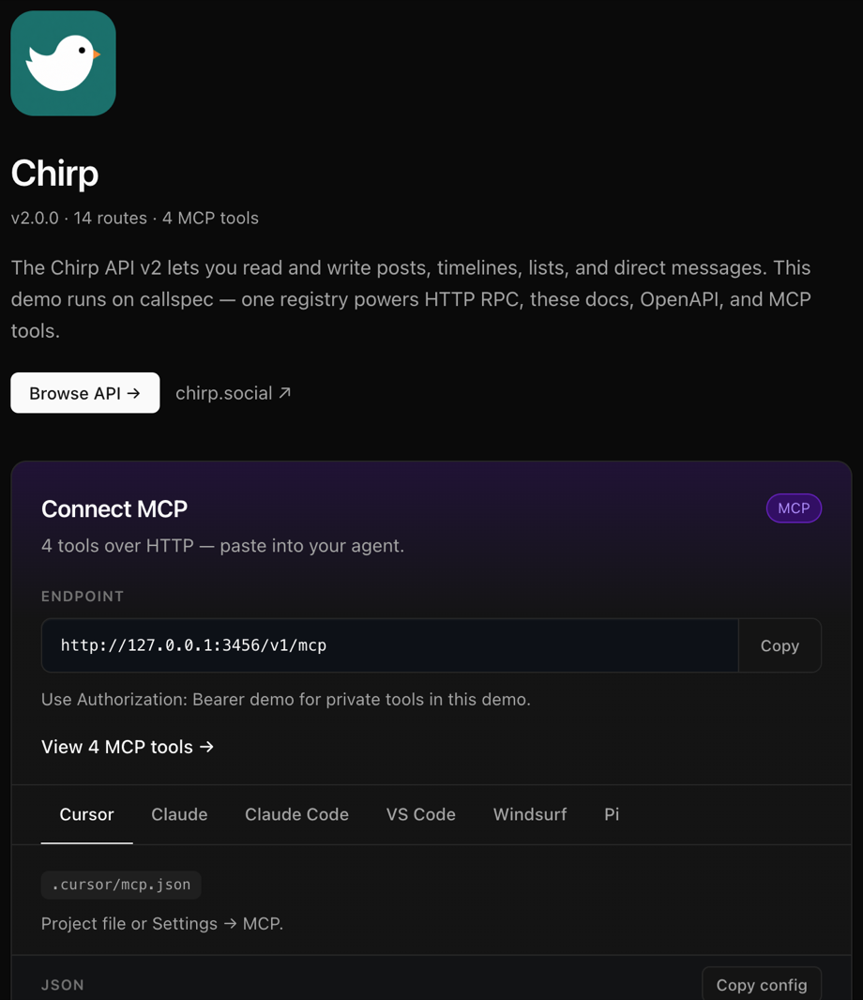

<div align="center">
  <picture>
    <source srcset="assets/lockup-light.svg" media="(prefers-color-scheme: light)" />
    <source srcset="assets/lockup-dark.svg" media="(prefers-color-scheme: dark)" />
    
  </picture>

  <p><strong>One registry. HTTP RPC, interactive docs, OpenAPI, MCP, and a typed client.</strong></p>
</div>

One `defineRegistry` powers HTTP RPC, OpenAPI, callsheet docs, MCP tools, and a typed client. Add a route once; it shows up everywhere.

<p align="center">
  <a href="assets/callsheet-chirp-demo-home.png">
    
  </a>
</p>

<p align="center"><sub><strong>callsheet</strong> — built-in docs UI with a <strong>Connect MCP</strong> panel. Copy the endpoint and a ready-made config for Cursor, Claude, VS Code, Windsurf, or Pi.</sub></p>

```typescript
import {defineRegistry, defineRoute, mountRegistry, mountMcp} from 'callspec';
import {predicates as p} from 'runtyp';

export const api = defineRegistry({
    getUserById: defineRoute({
        input: p.object({
            id: p.string({description: 'Unique identifier of the User (numeric string)'}),
        }),
        meta: {
            summary: 'Get User by ID',
            description: 'Returns information about a User specified by ID.',
            tags: ['users'],
        },
        access: 'private',
        mcp: true,           // → MCP tools/list
        handler: getUserById,
    }),
});

mountRegistry(app, api, {
    contextResolver: getChirpContext,
    docs: {
        openApi: {title: 'Chirp API v2', version: '2.0.0'},
        exposeUi: true,      // → /docs (callsheet + Connect MCP)
        exposeOpenApi: true, // → /openapi.json
    },
});

mountMcp(app, api, {path: '/mcp', contextResolver: getChirpContext});
```

Try the demo locally: `npm run build && npm run dev:docs` → [http://127.0.0.1:3456/v1/docs](http://127.0.0.1:3456/v1/docs) (Chirp API sample; use `Bearer demo` for private tools).

## Built-in MCP server

No separate MCP process. No hand-maintained tool manifest. No stdio bridge.

1. **Opt in per route** — `mcp: true` on any `defineRoute`. Input/output schemas come from the same runtyp preds as HTTP.
2. **Mount once** — `mountMcp(app, api, { path: '/mcp' })` on the same Express app. Streamable HTTP at `/mcp`.
3. **Connect from callsheet** — at `/docs`, the **Connect MCP** panel shows your endpoint and copy-paste configs for Cursor (`.cursor/mcp.json`), Claude Desktop, Claude Code CLI, VS Code, Windsurf, and Pi — including `Authorization` headers when you have private tools.

```typescript
searchRecent: defineRoute({
    input: p.object({
        query: p.string({description: 'Search query (supports operators like from:, #hashtag)'}),
        max_results: p.optional(p.number({
            description: 'Maximum number of results (1–100)',
            range: {min: 1, max: 100},
        })),
    }),
    meta: {
        summary: 'Search recent Tweets',
        description: 'Returns Tweets from the last seven days matching a search query.',
        tags: ['tweets'],
    },
    access: 'private',
    mcp: true,   // this route is now an MCP tool — same handler as POST /v1/searchRecent
    handler: searchRecent,
}),
```

Agents call the **same handlers** as your HTTP RPC. Auth uses the same `contextResolver` (e.g. `Authorization: Bearer …`). Public tools work without a token; private tools return 401 without one.

## Why callspec

| Surface | How you get it |
|---------|----------------|
| **HTTP RPC** | `POST /v1/<methodName>` |
| **Interactive docs** | Built-in **callsheet** UI at `/docs` |
| **OpenAPI 3.1** | `GET /openapi.json` from the same registry |
| **MCP tools** | `mcp: true` on a route → `tools/list` + `tools/call` at `/mcp` |
| **Typed client** | `client<API['searchRecent']>('searchRecent', input)` |

No second schema. No duplicate handler layer. No separate MCP subprocess.

## Batteries included

### callsheet — interactive docs

Minimal, fast docs UI baked into callspec. Browse routes, try RPCs, read OpenAPI, and **connect MCP clients** from the home page. Env-gated in production; flip on with:

```typescript
docs: {
    openApi: {title: 'Chirp API v2', version: '2.0.0'},
    exposeOpenApi: true,   // machine-readable spec
    exposeUi: true,        // human-readable /docs + Connect MCP
    openApiPath: '/openapi.json',
    uiPath: '/docs',
    callsheet: {
        branding: {
            name: 'Chirp',
            intro: 'The Chirp API v2 lets you read and write posts, timelines, lists, and direct messages.',
            websiteUrl: 'https://chirp.social',
            websiteLabel: 'chirp.social',
        },
        mcp: {
            authHint: 'Use Authorization: Bearer demo for private tools in this demo.',
        },
    },
}
```

Toggle each surface independently — spec only, UI only, both, or neither (`docs: false`).

### Auth

- **`access: 'public'`** — no credentials required (e.g. Chirp `healthcheck`, `getTweet`)
- **`access: 'private'`** (default) — 401 without `contextResolver` result
- App-specific auth stays in your `contextResolver` (e.g. map `Authorization: Bearer …` to `{userId, username}`)

Private gate runs **before** validation so unauthenticated callers never see field-level errors.

### runtyp + OpenAPI

Field `{ description }` on runtyp preds flows to JSON Schema → OpenAPI → callsheet → MCP `inputSchema`. Route-level `meta` (summary, tags) is callspec-only.

## Client

Fetch-only — works in the browser and in Node 18+ (global `fetch`). The `callspec/client` entry has no `http`, `https`, or Express imports, so it is safe in frontend bundles.

**Browser or frontend bundler** — import the client subpath so you do not pull server code:

```typescript
import type {API} from './chirp-api';   // InferRegistry<typeof api> from your registry module
import {client} from 'callspec/client';

const timeline = await client<API['searchRecent']>('searchRecent', {
    query: 'callspec',
    max_results: 10,
}, {
    endpoint: 'https://api.chirp.social/v2',
    fetchOptions: {headers: {Authorization: `Bearer ${token}`}},
});
```

**Service package** — export the API type once from your Chirp registry:

```typescript
import type {InferRegistry} from 'callspec';

export const api = defineRegistry({
    getTweet: defineRoute({ /* … */ }),
    searchRecent: defineRoute({ /* … */ }),
    createTweet: defineRoute({ /* … */ }),
});
export type API = InferRegistry<typeof api>;
```

Responses deserialize ISO date strings back to `Date` on read (`deserializeResponse`).

## Development

```bash
npm run validate   # build server + callsheet UI, lint, test (incl. integration)
npm run dev:docs   # Chirp demo API + callsheet at :3456/v1/docs
```

Integration tests spin up Express in-process and verify OpenAPI, `/docs`, auth, MCP schemas, and RPC end-to-end.

## Help build the standard

callspec is early — and we're looking for **maintainers and contributors** who want to help define how typed APIs work in the age of agents.

Swagger gave the world a shared language for REST. OpenAPI made it machine-readable. We're trying to do that again for **one registry → HTTP RPC, docs, OpenAPI, and MCP** — without the duplicate schemas, bolt-on tool manifests, and duct-tape between surfaces.

If you join now, you're not polishing someone else's finished spec. You're shaping the defaults: callsheet UX, MCP ergonomics, client DX, framework adapters, examples, and the docs people copy from. Early contributors tend to become the people others cite — show up in release notes, speak at the meetup, get asked "who built this?" when the pattern spreads.

**Good first contributions:** callsheet polish, MCP client configs, docs and demos, runtyp/OpenAPI edge cases, Fastify/Hono mounts, issue triage, or a blog post about your integration.

- **Issues & ideas:** [github.com/logfoxai/callspec/issues](https://github.com/logfoxai/callspec/issues)
- **PRs welcome** — `npm run validate` before you push; conventional commits (`feat:`, `fix:`, `docs:`, `style:`, etc.)

If you want maintainer access or a dedicated area to own (callsheet, MCP, clients, docs), open an issue or PR and say hi. We'd rather have a small crew that cares than a huge drive-by.

## Package layout

```
src/
  defineRoute.ts      # route definition + arity guard
  defineRegistry.ts   # named route map
  executeRoute.ts     # shared HTTP + MCP pipeline
  mountRegistry.ts    # POST routes + openapi + callsheet
  mountMcp.ts         # MCP on Express
  mcpTools.ts         # tools/list schemas from runtyp
  openapi.ts          # OpenAPI 3.1 emitter
  client.ts           # typed fetch client
  callsheet/          # built-in docs UI (bundled to dist/callsheet/ui)
```

Powered by [runtyp](https://github.com/logfoxai/runtyp) for validation.
