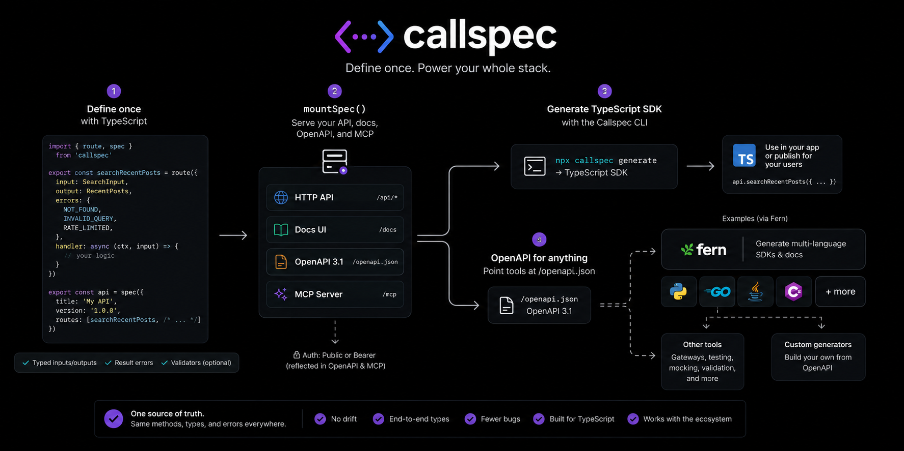

# Fern vs Callspec

Research note: does Fern (Postman) remove the need for Callspec?

**Verdict:** Yes, Callspec still has a reason to exist — but only if it stays in its real niche. Fern dominates a neighboring category; it does not replace what Callspec is.

## What Fern is

Fern is a **public-API DX platform**: take OpenAPI / Fern Definition / AsyncAPI / gRPC → idiomatic SDKs (9 languages) + polished docs (+ CLI).

Backing is real:

- YC W23
- ~$13M raised (Series A led by Bessemer)
- Customers include Square, Auth0, Adobe, Twilio, ElevenLabs
- Acquired by [Postman (Jan 2026)](https://blog.postman.com/postman-acquires-fern/); brand/product kept separate

Open-core (Apache CLI/generators); hosted docs/SDK product is the business. Job-to-be-done: *external* developer adoption of your API.

## What Callspec is

Not “generate a client.” One TypeScript registry (`route` + runtyp) that *is* the Express RPC server, boundary validation, white-label `/docs`, native `callspec.json`, OpenAPI projection, same-handler MCP at `/mcp`, and TS client/validator codegen so the browser never imports the server.

Closer to **tRPC / oRPC / ts-rest + MCP + docs** than to Fern / Stainless / Speakeasy.

## Side-by-side

| | Fern | Callspec |
|---|---|---|
| Primary buyer | Companies shipping public multi-lang APIs | Full-stack TS teams (internal + product API) |
| Source of truth | OpenAPI / YAML Fern Definition | Live TypeScript + runtyp |
| Server | Optional Express *boilerplate* from spec | `mountSpec` *is* the runtime |
| Clients | 9 languages, registry publish | TypeScript |
| MCP | Docs Q&A / Ask Fern; API-tool MCP still catching up (Stainless markets this harder today) | Handlers as tools on the same process |
| Form / shared types & validators | Not the product | `exports` → shared types + runtyp preds for React |
| Errors | HTTP / OpenAPI style | Result-typed, code-as-contract |
| Maturity | Postman-scale | Early, Logfox-dogfooded |

Marketing language overlaps (“one spec → SDKs, docs, OpenAPI, MCP”). **Product shape does not.**

## Is there still a reason to exist?

**As a Fern competitor: no.** Multi-lang SDKs, enterprise docs, polish, and distribution are not a fight Callspec wins.

**As a TS-native RPC + contract + agent surface: yes.** Fern kept API defs out of TypeScript (YAML/DSL for readability, language servers, cross-team specs). Their Express generator is “implement against generated stubs,” not “handlers + validation + MCP + docs from one `route()`.” Shared runtyp validators for forms, Result errors, and process-mounted MCP are still Callspec-shaped — Fern doesn't own that stack.

Realistic framing:

1. **Callspec = code-first server contract for TypeScript**
2. **Fern / Stainless = consume OpenAPI for public multi-lang DX**

Those can compose: Callspec emits `/openapi.json` → Fern for Python/Go + public docs if needed. Callspec does not need to grow into Fern's product.



```bash
# After mountSpec is serving your API:
curl -o openapi.json http://127.0.0.1:3000/v1/openapi.json
fern init --openapi ./openapi.json
fern add fern-python-sdk   # Go, Java, Ruby, C#, …
fern generate
```

## Risks

Not “Postman killed Callspec.” The risks are:

1. **Category confusion** — same tagline territory as a Postman-backed platform, while real peers are tRPC-class tools.
2. **MCP catch-up** — Stainless (and eventually Fern) shipping solid API-tool MCP from OpenAPI eats one Callspec bullet unless the colocated-handler story stays sharper.

## Recommendation

Keep Callspec. Narrow the story: *TypeScript-first RPC runtime with portable contract, shared validation, and live MCP — OpenAPI as export, not IR.* Use Fern only if/when multi-lang public SDKs or Postman-grade docs are needed. Do not try to out-Fern Fern.
