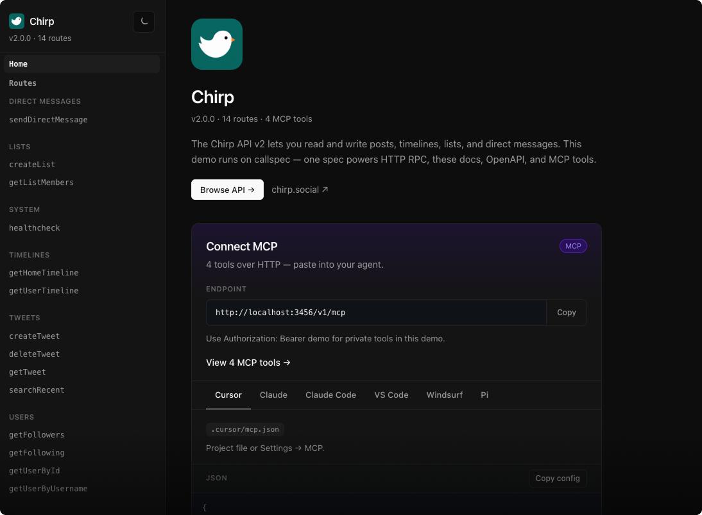

# Docs UI

After `mountSpec`, open **`{mount}/docs`** (e.g. `http://127.0.0.1:3000/v1/docs`) for a white-label explorer over the same routes as your RPC server — try methods, inspect schemas and error codes, and copy MCP client config.



## What people do here

| Goal | How |
|------|-----|
| Try an RPC | Open a route → fill the form → run. Same validation and error codes as production HTTP. Sticky try-it panel on wide viewports. |
| See the contract | Input/output schemas and declared domain errors on each route detail page; prev/next within the tag group. |
| Find a route | Header search filters the sidebar (and route list) by name, summary, description, and tags. Press `/` to focus. |
| Browse on mobile | Hamburger opens a full nav drawer (routes, search, theme). |
| Connect an agent | Home page **MCP connect** panel — endpoint URL + Cursor/Claude-style snippets (`authHint` when bearer tools exist). |
| Hand someone OpenAPI | `{mount}/openapi.json` is served next to the UI when docs are on — header buttons beside the theme toggle (and in the mobile nav drawer). |
| Pin the Callspec contract | `{mount}/callspec.json` — what `npx callspec` reads for the TypeScript SDK. |
| Install a client SDK | Optional `meta.sdkInstall` string on the home page with a copy button. |

**Home is always on** — title, version, route/MCP counts, optional SDK install hint, Browse API, and the MCP connect panel. Optional `meta.intro` is only the welcome blurb. Theme colors, navbar links, favicon, footer, and optional plain-text `notice`: [Branding](./docs-ui-branding.md). Route list is grouped by `tags`.

## Minimal setup

Docs are **on by default**. If you already followed [Getting started](./getting-started.md), the UI is at `/v1/docs` with no extra config.

```typescript
mountSpec(router, api); // docs + callspec.json + openapi.json enabled
```

Change only the UI URL (contract paths stay fixed):

```typescript
mountSpec(router, api, {docsPath: '/explorer'});
// UI:       /v1/explorer
// Contract: /v1/callspec.json
// OpenAPI:  /v1/openapi.json
```

The UI always fetches **`../callspec.json` relative to the docs path** — renaming `docsPath` does not rename the contract URL. Full options: [`mountSpec`](./api-reference/mount-spec.md).

Title, logo, theme, navbar, footer, MCP hints, and escape hatches: **[Branding](./docs-ui-branding.md)**.

## Hide in production

Optional — leave docs on in every environment, or turn them off where you don’t want the explorer / contract JSON public:

```typescript
mountSpec(router, api, {
    docs: process.env.NODE_ENV !== 'production',
});
```

`docs: false` disables the UI **and** `/callspec.json` and `/openapi.json` on that mount. If production still needs those JSON files for codegen or gateways, keep `docs: true` and put the mount behind your own auth or network controls instead.

## Auth in the try-it form

Routes with `auth: 'bearer'` need a token in the UI session (same `Authorization: Bearer …` your app sends). Public `auth: 'none'` routes run without one. How auth is wired on the server: [Authentication](./authentication.md).

## Related

- [Branding](./docs-ui-branding.md) — `meta` title, logo, theme, navbar, footer, escape hatches, auth/MCP hints
- [Hosting (CloudFront / Pages)](./hosting-cloudfront-pages.md) — reverse proxy vs static export
- [MCP](./mcp.md) — `mcp: true` on routes, connect from the home panel
- [OpenAPI](./openapi.md) — `/openapi.json` for gateways and multi-lang tools
- [SDK generation](./sdk-generation.md) — TypeScript client from `callspec.json`, not from the docs UI
