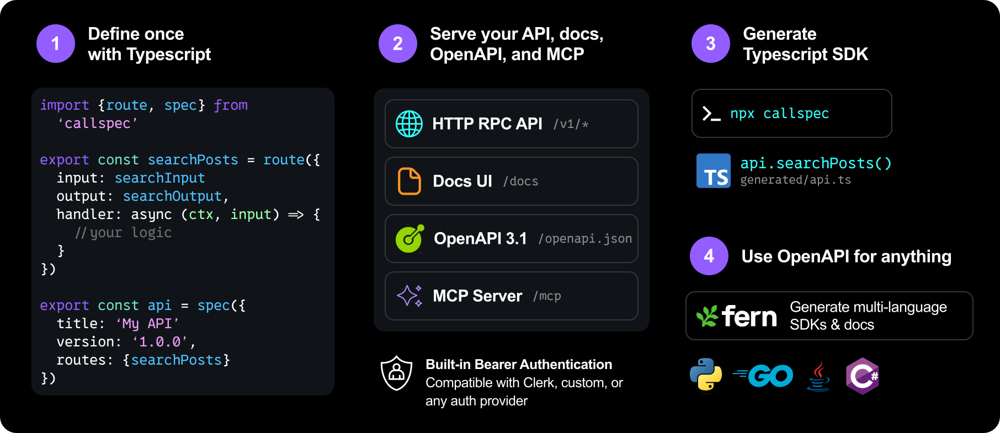

# Callspec + Fern

Callspec is your **TypeScript runtime** — server, integrated TS SDK, in-process MCP, docs, and `/openapi.json` from one `route()` registry. [Fern](https://buildwithfern.com/) is an optional **public DX layer** — multi-language SDKs and hosted docs for external developers.

They are **synergistic, not either/or**. Typical flow: `mountSpec` serves your API → export `/openapi.json` → Fern generates public SDKs and docs. Keep Callspec for everything TypeScript; add Fern when external, multi-language DX is worth a hosted account.

The overlap is small: **docs**, nominally **TypeScript clients**, and a surface-level **MCP** label — but each pair does different work (see below). Everything composes cleanly.

## How they compare

| | Callspec | Fern |
|---|---|---|
| **Job** | Run the API in TypeScript; ship TS client, MCP, contracts | Public developer adoption — SDKs + docs in many languages |
| **Source of truth** | Live TypeScript + runtyp | OpenAPI / Fern Definition (from Callspec's `/openapi.json` or elsewhere) |
| **Server** | `mountSpec` *is* the runtime | Does not replace your server |
| **TS client** | Generated from `callspec.json` — Result-typed, exhaustive errors, `NETWORK_ERROR`, shared runtyp validators | Can emit TS from OpenAPI — idiomatic HTTP client, not callspec-native |
| **Multi-lang SDKs** | Fern's job (via `/openapi.json`) | Core product (Python, Go, Java, C#, …) |
| **MCP** | **API tools** — in-process `/mcp`; same resolvers, auth, validation as RPC | **Docs MCP** — hosted on Fern docs site; agents query **documentation** (Ask Fern), not your live API |
| **Docs** | Built-in `/docs` — fast, white-label, good for **internal** and many product cases | Enterprise public docs — localization, deep customization, Postman-scale polish |
| **Cost / account** | **[MIT](https://github.com/logfoxai/callspec)** — fully open source, self-hosted, **no account** | Hosted platform — **account required**; hobby tier available; **paid** for production-grade public DX |

Fern ([acquired by Postman, Jan 2026](https://blog.postman.com/postman-acquires-fern/)) targets teams that need **external** developers to succeed in many languages. Callspec targets **full-stack TypeScript** teams that want one registry for server, browser SDK, agents, and contract — without leaving TypeScript.

## Licensing & hosting

**Callspec** is [MIT-licensed](https://github.com/logfoxai/callspec) and runs entirely on your infrastructure. `npm i callspec`, `mountSpec`, docs UI, MCP, CLI codegen — no vendor account, no hosted control plane, no usage gates.

**Fern** is **open-core** (Apache-licensed CLI and generators on GitHub) but the **product** is a hosted docs + SDK platform. You sign up, connect a repo or spec, and use Fern's cloud to build and host public docs and publish SDKs. A **hobby** tier exists, but you still need a Fern account; serious public-DX features (custom domains, auth, team workflows, enterprise polish) are **paid**.

That difference matters most for **internal APIs** and early products: Callspec gives you the full stack on day one with zero vendor lock-in. Add Fern later when public, multi-language DX is worth the hosted investment.

## Docs

**Callspec docs work well for a lot of teams** — especially internal APIs, small product surfaces, and simple public docs you control (`meta` branding, try-it RPC, MCP connect). Override `docsPath` or whitelabel via `meta`.

**Fern is the better fit when public docs are the product** — large external developer programs, **multilingual** doc sites, heavy layout/branding customization, and the polish expectations that come with Postman-scale public DX.

You can run **both**:

- **Callspec `/docs` for internal** (or for a lightweight product explorer) **+ Fern for the public site** fed from the same `/openapi.json`.
- **Fern only** and turn off Callspec docs with `{docs: false}`. Or turn it off just for `production`.

There is no requirement to pick one doc stack. Teams that adopt Fern still keep Callspec as the runtime and contract source.

## TypeScript SDK

Both can produce a TypeScript client. **Use Callspec's for your app** — it is generated from `callspec.json`, not generic OpenAPI, and is tightly integrated with the rest of the stack:

| | Callspec `ApiClient` | Fern (or other OpenAPI) TS SDK |
|---|---|---|
| **Error model** | **Result** — `{ ok, value }` or `{ ok: false, code, … }`; exhaustive `code` union per method | Typical throw / HTTP status patterns from OpenAPI |
| **Domain errors** | Same codes as server, MCP, and docs — switch is exhaustive | Mapped from HTTP; no callspec error contract |
| **Client-only errors** | `NETWORK_ERROR`, `UNKNOWN_ERROR` built in | Varies by generator |
| **Validation sharing** | Same runtyp preds via `exports` + `--validators` for forms | Not part of the product |
| **Integration** | One registry → server, SDK, MCP, docs stay in sync | Consumer of `/openapi.json`; parallel surface |

Fern's Python/Go/Java SDKs (and any TS SDK they emit) are best for **external** developers. They will not get Result-typed domain errors, shared form validators, or the same codegen loop as your frontend. That is by design — OpenAPI cannot carry the full callspec contract.

**Typical split:** `npx callspec` for your TypeScript app; Fern for every other language (and optional public docs).

## MCP

Both mention MCP, but they solve **different agent problems**.

### Callspec MCP — call your API

`mountSpec` serves **`/mcp`** on the **same process** as your RPC server. Routes with `mcp: true` become MCP tools that invoke the **same resolvers** as HTTP — same Bearer auth, runtyp validation, and error codes. Connect from the built-in docs UI; no separate doc product required.

This is for agents that need to **execute** your API (create resources, run queries, etc.) with production auth and validation.

### Fern MCP — query your public docs

Fern [auto-hosts an MCP server](https://buildwithfern.com/learn/docs/ai-features/mcp-server) on **Fern docs sites** (with [Ask Fern](https://buildwithfern.com/learn/docs/ai-features/ask-fern/overview) enabled) at:

```text
https://your-docs-site.com/_mcp/server
```

That server exposes your **documentation** to AI clients (Cursor, Claude Code, Windsurf, …) as a live data source — essentially **Ask Fern search over your docs**, not `tools/call` against your running API. Agents get answers *about* your product from the doc site; they do not hit your Callspec server through this path.

**Separate surface:** Fern docs MCP requires a **Fern-hosted docs site**. It is configured in Fern (`docs.yml`; set `page-actions.options.mcp: false` to disable). Authenticated doc sites need a **`FERN_TOKEN`** JWT on the MCP client — separate from your API's Bearer auth.

Fern also ships **`llms.txt`** and per-page Markdown as non-MCP ways for agents to read docs.

### API-tool MCP from Fern (early)

Fern is working on a [TypeScript MCP server generator](https://github.com/fern-api/fern/pull/7121) that would expose generated SDK methods as MCP tools in a **standalone server** — OpenAPI/SDK-shaped, not colocated with `mountSpec`. That is not the same as Callspec's in-process tools and would not carry callspec's Result contract, shared validators, or `authenticate` hook. Treat it as early / separate if you evaluate it.

**Do not confuse** Fern docs MCP with the [Postman MCP server](https://www.postman.com/product/mcp-server/) (Postman collections, workspaces, code-gen context) — another product in the Postman family after the Fern acquisition.

### Using both

| Need | Use |
|------|-----|
| Agents **call** your API with real auth | Callspec `/mcp` |
| Agents **search** public docs / Ask Fern | Fern `/_mcp/server` on your doc site |
| Internal agents + internal docs | Callspec docs + Callspec MCP — often enough alone |
| Public docs at Fern scale + API tools | Fern public docs MCP **+** Callspec MCP on the API |

No either/or. Most teams that add Fern for public DX still run Callspec MCP on the server for live API access.

## Typical stack

Callspec owns TypeScript end-to-end; Fern consumes the OpenAPI export for **public** multi-lang DX:



```bash
# Callspec serves the API and contract
curl -fsS http://127.0.0.1:3000/v1/openapi.json -o openapi.json

# Fern for public SDKs + public docs (optional)
fern init --openapi ./openapi.json
fern add fern-python-sdk   # Go, Java, Ruby, C#, …
fern generate
```

Your **TypeScript app** keeps the Callspec-generated `ApiClient` (`npx callspec …`). **External developers** get Fern SDKs (other languages + optional public docs) from the same API.

## When to add Fern

Consider Fern when you need **public** DX Callspec does not optimize for:

- Idiomatic SDKs in languages beyond TypeScript
- Public doc sites with localization and deep customization
- Enterprise external-developer programs (onboarding, versioning, hosted docs at scale)

Skip Fern when TypeScript + Callspec docs + `/openapi.json` for gateways and tooling is enough — common for internal platforms and many product APIs.

## Summary

- **Callspec** — MIT, self-hosted, no account; integrated TS SDK, in-process API MCP, internal-friendly docs.
- **Fern** — hosted public DX (account required; hobby + paid tiers); multi-language SDKs and public docs.
- **Together** — `mountSpec` → `/openapi.json` → Fern; keep or disable Callspec docs as you prefer.

Not competitors. Composable layers.

